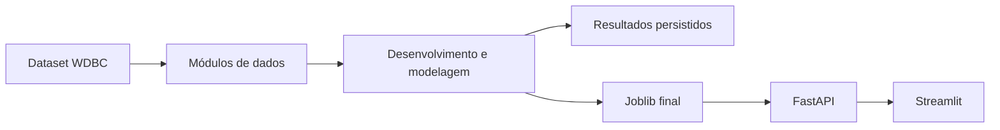
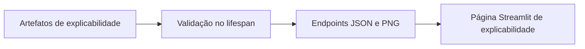
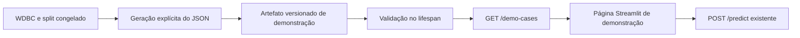

# Arquitetura — FemHealth Clinical AI

## Princípios

A arquitetura segue estes princípios:

- separação de responsabilidades;
- reprodutibilidade;
- ausência de treinamento durante uso;
- contratos explícitos;
- artefatos imutáveis;
- interface desacoplada.

## Visão geral

Fluxo principal:



Fluxo de explicabilidade:



Fluxo dos casos de demonstração:



## Componentes

| Arquivo | Responsabilidade |
| --- | --- |
| `src/femhealth/data.py` | Carregamento e contrato do WDBC |
| `src/femhealth/data_split.py` | Separação estratificada desenvolvimento/teste |
| `src/femhealth/model_pipelines.py` | Pipelines dos modelos candidatos |
| `src/femhealth/model_evaluation.py` | Benchmark baseline em validação cruzada |
| `src/femhealth/model_tuning.py` | Ajuste controlado de hiperparâmetros |
| `src/femhealth/probability_analysis.py` | Probabilidades, calibração e limiares |
| `src/femhealth/final_selection.py` | Seleção congelada do modelo final |
| `src/femhealth/final_evaluation.py` | Avaliação preparada do holdout final |
| `src/femhealth/model_artifact.py` | Persistência e carregamento validado do Joblib |
| `src/femhealth/inference.py` | Contrato de inferência tabular |
| `src/femhealth/explainability_artifacts.py` | Validação dos artefatos de explicabilidade |
| `src/femhealth/demo_cases_run.py` | Geração explícita dos oito casos do holdout |
| `src/femhealth/demo_cases_artifact.py` | Validação do artefato de demonstração |
| `src/femhealth/api.py` | FastAPI e ciclo de vida dos artefatos |
| `src/femhealth/api_client.py` | Cliente HTTP usado pela interface |
| `src/femhealth/streamlit_pages.py` | Páginas Streamlit em português |

## Fluxo de desenvolvimento

As funções de análise, ajuste e avaliação podem treinar modelos em notebooks ou
comandos explícitos. Esse treinamento pertence ao fluxo de desenvolvimento, não
ao fluxo de uso da aplicação.

O artefato final foi treinado somente com os 455 registros de desenvolvimento.
O holdout final não entrou no treinamento.

## Fluxo de inferência

A requisição de inferência contém 30 valores numéricos. A API valida as chaves,
normaliza a ordem para a ordem canônica do WDBC, executa o estimador carregado e
extrai explicitamente a probabilidade da classe maligna `0`.

A regra de decisão aplica o limiar maligno 0.51:

- probabilidade maligna maior ou igual a 0.51 → classe 0;
- probabilidade maligna menor que 0.51 → classe 1.

## Fluxo de explicabilidade

Os resultados de explicabilidade são previamente calculados e persistidos em
CSV, JSON e PNG. A aplicação não recalcula importância por requisição.

No startup da FastAPI, os artefatos são lidos, validados e armazenados em
memória. Durante as requisições, a API apenas expõe o payload JSON validado e os
bytes PNG já carregados.

## Fluxo de casos de demonstração

O artefato `artifacts/demo/holdout_demo_cases.json` contém oito registros reais
do holdout final. Ele foi criado por comando explícito após a avaliação final
congelada, usando os primeiros oito registros na ordem congelada do holdout
final, sem seleção por desempenho ou classe prevista.

A FastAPI valida esse JSON no `lifespan`, armazena o payload em `app.state` e
expõe `GET /demo-cases`. Esse endpoint não executa inferência, não lê arquivos
por requisição e não revela caminhos locais. A página Streamlit consome esse
endpoint uma vez por renderização e usa o `POST /predict` existente para
classificar cada registro selecionado.

O placar da página é estado de sessão do Streamlit e contabiliza somente casos
únicos executados. Ele não altera artefatos, métricas oficiais, modelo ou
threshold.

## Estados e ciclo de vida

A FastAPI usa `lifespan` para carregar:

- estimador e metadados do modelo;
- payload e PNG de explicabilidade;
- payload de casos de demonstração.

Esses objetos ficam em `app.state` durante a vida da aplicação e são removidos no
shutdown. Quando o estado necessário não está disponível, os endpoints retornam
HTTP 503.

## Limites de confiança

O projeto diferencia:

- código de análise, que pode treinar em comandos explícitos;
- artefatos persistidos, que representam resultados congelados;
- FastAPI, que carrega e expõe os artefatos;
- cliente Streamlit, que consome apenas HTTP;
- entrada do usuário, que deve obedecer ao contrato de 30 variáveis.

## Estrutura do repositório

```text
.
├── artifacts/demo/
├── artifacts/model/
├── docs/
├── notebooks/
├── reports/explainability/
├── reports/results/
├── src/femhealth/
├── tests/
├── README.md
├── pyproject.toml
└── streamlit_app.py
```

## Decisões arquiteturais

Decisões registradas:

- notebook não é executado pela API;
- Streamlit não carrega Joblib;
- Streamlit não lê `reports/explainability` diretamente;
- API não treina modelos;
- explicabilidade não é recalculada por requisição;
- casos de demonstração não são selecionados por desempenho;
- FastAPI carrega artefatos uma vez no `lifespan`;
- Streamlit consome a inferência exclusivamente pela API;
- futuras avaliações independentes exigem novos dados externos ou novo conjunto
  preservado.
